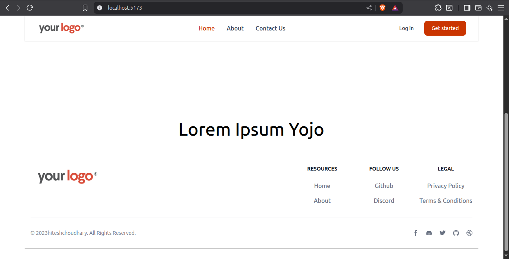

# Day 6-7 - React Router Basics

In this project, I explored React Router and how to handle navigation in Single Page Applications (SPAs). Instead of reloading pages like traditional websites, React Router enables smooth client-side routing.
---

##  What I Learned

-  Link & NavLink → For navigation between routes.
-  Active Links → Apply styles to highlight the current active route.
-  useParams → Access and display dynamic data from the URL
-  Created a small multi-page project to practice routing

----

##  Tech Stack

- React (Functional Components)
- HTML + TailwindCss
- Hooks: ``react-router-dom`

---

##  Preview

---

