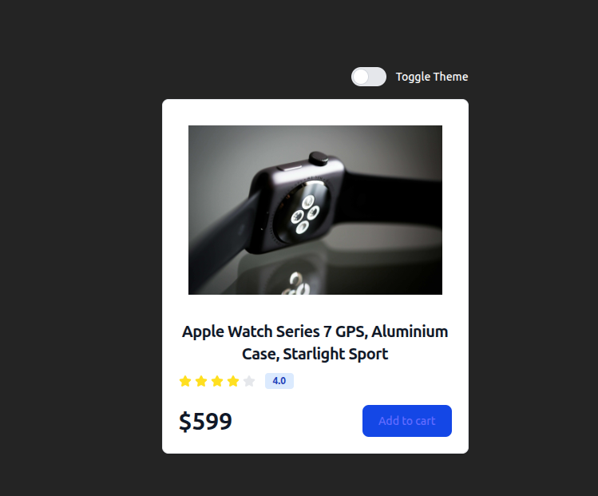

# 🌗 Theme Changer (React + Context API)

A simple and interactive **Theme Changer App** built with **React** using the **Context API** for global state management.  
This project demonstrates how to toggle between **Light Mode** and **Dark Mode** efficiently without prop drilling.

---

##  Features

-  Switch between Light and Dark themes  
-  Managed global state using React Context API  
-  Smooth theme transitions  
-  Component-based and reusable architecture  
-  Minimal and clean UI  

---

##  Technologies Used

- **React (Vite)**  
- **Context API** for state management  
- **TailwindCss**  
- **JavaScript (ES6+)**

---

##  Preview

**Without Toggle:-**

**Without Toggle:-**

 ---
